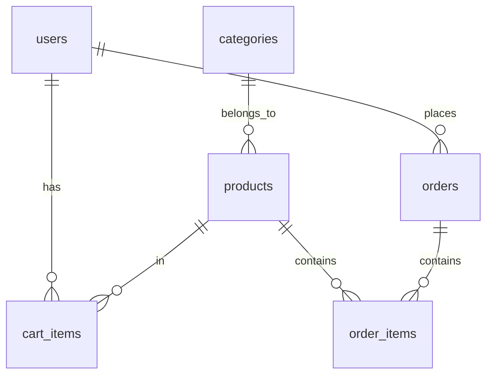

# 焕遗 IP交易平台 数据库设计文档

## 目录
1. [数据库概述](#数据库概述)
2. [表结构设计](#表结构设计)
3. [索引设计](#索引设计)
4. [关系图](#关系图)

## 数据库概述

本系统使用 PostgreSQL 数据库，主要包含以下核心表：
- users（用户表）
- products（商品表）
- categories（分类表）
- cart_items（购物车表）
- orders（订单表）
- order_items（订单项表）

## 表结构设计

### users（用户表）
```sql
CREATE TABLE users (
    id UUID PRIMARY KEY DEFAULT gen_random_uuid(),
    username VARCHAR(50) NOT NULL UNIQUE,
    email VARCHAR(100) NOT NULL UNIQUE,
    password_hash VARCHAR(255) NOT NULL,
    avatar_url VARCHAR(255),
    role VARCHAR(20) NOT NULL DEFAULT 'user',
    created_at TIMESTAMP WITH TIME ZONE DEFAULT CURRENT_TIMESTAMP,
    updated_at TIMESTAMP WITH TIME ZONE DEFAULT CURRENT_TIMESTAMP
);
```

### products（商品表）
```sql
CREATE TABLE products (
    id UUID PRIMARY KEY DEFAULT gen_random_uuid(),
    name VARCHAR(100) NOT NULL,
    type VARCHAR(50) NOT NULL,
    category_id UUID NOT NULL,
    price DECIMAL(10,2) NOT NULL,
    description TEXT,
    image_url VARCHAR(255),
    detail TEXT,
    license_types JSONB NOT NULL,
    license_terms JSONB NOT NULL,
    restrictions JSONB NOT NULL,
    images JSONB NOT NULL,
    created_at TIMESTAMP WITH TIME ZONE DEFAULT CURRENT_TIMESTAMP,
    updated_at TIMESTAMP WITH TIME ZONE DEFAULT CURRENT_TIMESTAMP,
    FOREIGN KEY (category_id) REFERENCES categories(id)
);
```

### categories（分类表）
```sql
CREATE TABLE categories (
    id UUID PRIMARY KEY DEFAULT gen_random_uuid(),
    name VARCHAR(50) NOT NULL UNIQUE,
    description TEXT,
    created_at TIMESTAMP WITH TIME ZONE DEFAULT CURRENT_TIMESTAMP,
    updated_at TIMESTAMP WITH TIME ZONE DEFAULT CURRENT_TIMESTAMP
);
```

### cart_items（购物车表）
```sql
CREATE TABLE cart_items (
    id UUID PRIMARY KEY DEFAULT gen_random_uuid(),
    user_id UUID NOT NULL,
    product_id UUID NOT NULL,
    quantity INTEGER NOT NULL DEFAULT 1,
    created_at TIMESTAMP WITH TIME ZONE DEFAULT CURRENT_TIMESTAMP,
    updated_at TIMESTAMP WITH TIME ZONE DEFAULT CURRENT_TIMESTAMP,
    FOREIGN KEY (user_id) REFERENCES users(id) ON DELETE CASCADE,
    FOREIGN KEY (product_id) REFERENCES products(id) ON DELETE CASCADE,
    UNIQUE(user_id, product_id)
);
```

### orders（订单表）
```sql
CREATE TABLE orders (
    id UUID PRIMARY KEY DEFAULT gen_random_uuid(),
    user_id UUID NOT NULL,
    total_amount DECIMAL(10,2) NOT NULL,
    status VARCHAR(20) NOT NULL DEFAULT 'pending',
    created_at TIMESTAMP WITH TIME ZONE DEFAULT CURRENT_TIMESTAMP,
    updated_at TIMESTAMP WITH TIME ZONE DEFAULT CURRENT_TIMESTAMP,
    FOREIGN KEY (user_id) REFERENCES users(id)
);
```

### order_items（订单项表）
```sql
CREATE TABLE order_items (
    id UUID PRIMARY KEY DEFAULT gen_random_uuid(),
    order_id UUID NOT NULL,
    product_id UUID NOT NULL,
    quantity INTEGER NOT NULL,
    price DECIMAL(10,2) NOT NULL,
    created_at TIMESTAMP WITH TIME ZONE DEFAULT CURRENT_TIMESTAMP,
    FOREIGN KEY (order_id) REFERENCES orders(id) ON DELETE CASCADE,
    FOREIGN KEY (product_id) REFERENCES products(id)
);
```

## 索引设计

### users 表索引
```sql
CREATE INDEX idx_users_username ON users(username);
CREATE INDEX idx_users_email ON users(email);
```

### products 表索引
```sql
CREATE INDEX idx_products_category ON products(category_id);
CREATE INDEX idx_products_type ON products(type);
CREATE INDEX idx_products_created_at ON products(created_at);
```

### cart_items 表索引
```sql
CREATE INDEX idx_cart_items_user ON cart_items(user_id);
CREATE INDEX idx_cart_items_product ON cart_items(product_id);
```

### orders 表索引
```sql
CREATE INDEX idx_orders_user ON orders(user_id);
CREATE INDEX idx_orders_status ON orders(status);
CREATE INDEX idx_orders_created_at ON orders(created_at);
```

### order_items 表索引
```sql
CREATE INDEX idx_order_items_order ON order_items(order_id);
CREATE INDEX idx_order_items_product ON order_items(product_id);
```

## 关系图



### 关系说明

1. 用户与购物车：一对多关系
   - 一个用户可以添加多个商品到购物车
   - 购物车项必须属于一个用户

2. 用户与订单：一对多关系
   - 一个用户可以创建多个订单
   - 订单必须属于一个用户

3. 商品与购物车：一对多关系
   - 一个商品可以被多个用户添加到购物车
   - 购物车项必须关联一个商品

4. 商品与订单项：一对多关系
   - 一个商品可以出现在多个订单中
   - 订单项必须关联一个商品

5. 分类与商品：一对多关系
   - 一个分类可以包含多个商品
   - 商品必须属于一个分类

6. 订单与订单项：一对多关系
   - 一个订单可以包含多个商品
   - 订单项必须属于一个订单 